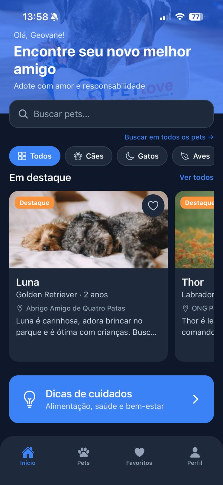
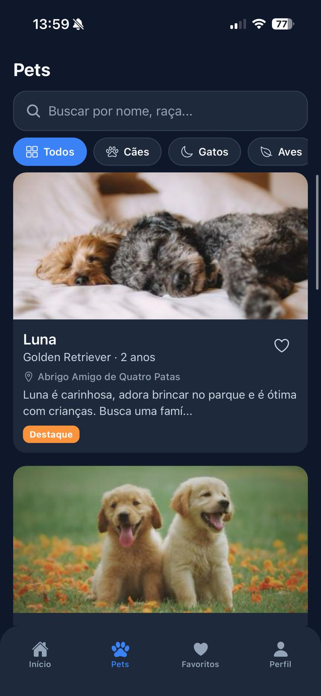
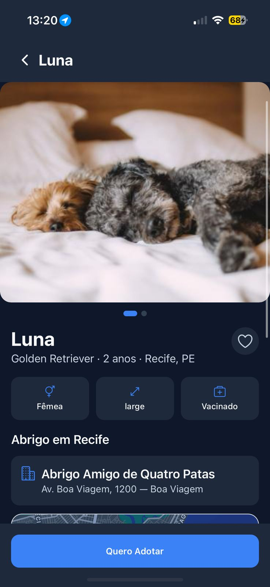
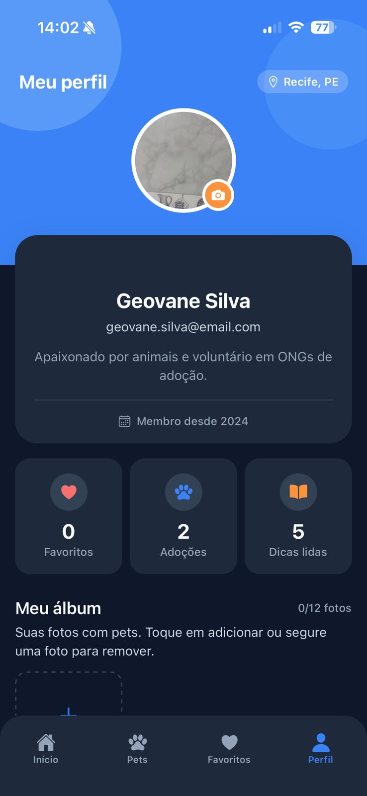
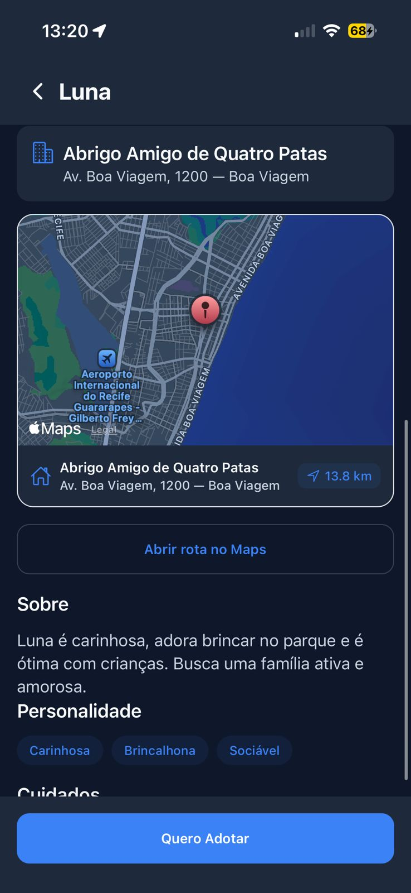

# PetLove — App de Adoção de Pets

Aplicativo mobile de adoção de pets construído com **React Native + Expo + TypeScript**, sem backend — dados simulados localmente com mocks e **AsyncStorage** para favoritos.

## Funcionalidades

- Home com banner, busca, categorias e pets em destaque
- Lista de pets com **FlatList**, busca, filtros e scroll infinito simulado
- Detalhes do pet com carrossel, favoritar e formulário de adoção
- Favoritos persistidos (**Zustand + AsyncStorage**)
- Formulário de adoção com **React Hook Form + Yup**
- Perfil, configurações (tema claro/escuro/sistema) e dicas de cuidados

## Stack

React Native · Expo SDK 54 · TypeScript · React Navigation (Stack + Tabs) · React Hook Form · Yup · AsyncStorage · Zustand · Reanimated · Expo Vector Icons

## Sensores (requisito acadêmico)

| Sensor | Uso no app |
|--------|------------|
| **GPS** (`expo-location`) | Distância até abrigos em Recife + mapa na tela de detalhes |
| **Câmera** (`expo-image-picker`) | Foto de perfil e álbum do usuário (câmera ou galeria) |

## Screenshots

### Home


### Lista de pets


### Detalhes do pet


### Perfil


### Sensores (GPS e mapa)


## Estrutura

```
src/
├── assets/
├── components/
├── screens/
├── navigation/
├── routes/
├── services/      # API simulada (pronta para Axios real)
├── hooks/
├── store/
├── context/
├── data/
├── mocks/
├── constants/
├── utils/
├── types/
├── theme/
└── styles/
```

## Como executar

```bash
npm install
npm run start:lan
```

- PC e celular na **mesma rede Wi‑Fi** (evite dados móveis no celular)
- Escaneie o QR code com **Expo Go**
- O endereço deve ser `exp://192.168.x.x:8081` (não `127.0.0.1`)
- Pressione `w` para web · `a` para Android

### Problemas de conexão

| Problema | Solução |
|----------|---------|
| `could not connect to server` | Use `npm run start:lan` e mesma Wi‑Fi |
| QR com `127.0.0.1` | Use `npm run start:lan` (não `expo start` puro) |
| `session closed` / tunnel falha | Configure **seu** token ngrok (abaixo) |
| Firewall Windows | Permita Node.js nas redes privadas |

```bash
# Mesma rede Wi‑Fi
npm run start:lan

# Qualquer pessoa na internet (ngrok) — requer token gratuito
npm run start:tunnel
```

### Túnel ngrok (compartilhar com qualquer pessoa)

O Expo usa um token ngrok compartilhado que **estoura limite** e gera `session closed`. Use **seu token gratuito**:

1. Crie conta: https://dashboard.ngrok.com/signup  
2. Copie o authtoken: https://dashboard.ngrok.com/get-started/your-authtoken  
3. Crie `.env` na raiz (copie de `.env.example`):

```env
NGROK_AUTHTOKEN=seu_token_aqui
```

4. Inicie o túnel:

```bash
npm run start:tunnel
```

5. O terminal mostrará URLs como:
   - `https://xxxx.ngrok-free.app` (HTTPS)
   - `exp://xxxx.ngrok-free.app` (Expo Go)

   Qualquer pessoa com **Expo Go** pode abrir via QR ou **Enter URL manually**.

> Usa **ngrok v3** (`@ngrok/ngrok`). Contas ngrok novas não aceitam mais o agente 2.x embutido no Expo (`ERR_NGROK_121`).

> Feche VPN/antivírus se o túnel ainda cair. O script `kill-dev.ps1` libera a porta 8081 antes de subir.

## Equipe

| Integrante | Matrícula |
|------------|-----------|
| Ananda Almeida Ramos | 01791623 |
| Caio Gabriel Medeiros dos Santos | 01832014 |
| Geovane Valério Ribeiro da Silva | 01817390 |
| Heitor Júlio de Souza Batista | 01807641 |
| José Lúfyo César França Camelo | 01796241 |
| Lieberty Wendell Queiroz de Holanda | 01811624 |
| Rafael França Beuttenmuller | 01813899 |
| Vanessa Camelo Lins do Nascimento | 01790811 |

---

Desenvolvido para fins acadêmicos · PetLove © 2026
